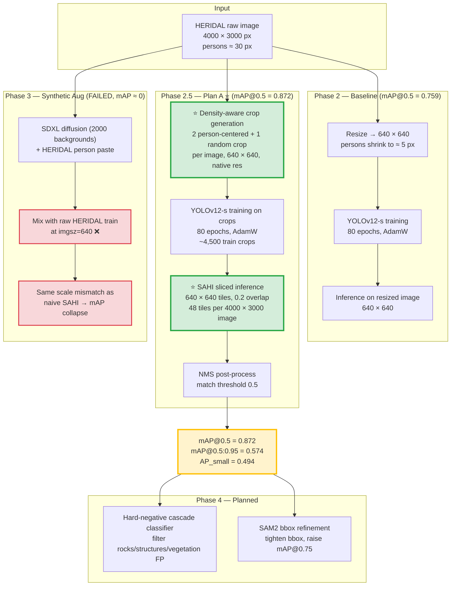

# UAV Search & Rescue Person Detection

> Real-time UAV person detection for wilderness Search and Rescue. Built on YOLOv12-s + HERIDAL; main contribution is a **density-aware training crops + SAHI sliced inference pipeline** ([Plan A](results/plan_a_analysis.md)) that improves HERIDAL mAP@0.5 from a baseline of 0.759 to **0.872** without modifying the detector architecture.

---

## Introduction

### The problem we are solving

When a person goes missing in a wilderness area — hikers lost in forests, mountaineers stranded on slopes, survivors in flooded or earthquake-hit regions — **the search radius grows quadratically with elapsed time**, and ground search teams cover terrain slowly. Unmanned aerial vehicles (UAVs / drones) can sweep that terrain orders of magnitude faster, but a human operator watching the live video stream cannot reliably spot a ~30-pixel person against forest, rocks, or vegetation across hours of footage. Automated **aerial person detection** is therefore a real SAR bottleneck: turn a UAV's camera feed into actionable detections in real time.

Concretely, the technical problem is:

> Given an aerial RGB image (~4000×3000 px) captured from a UAV at typical SAR altitude, **detect every person in the scene with tight bounding boxes**, in real time, on hardware that fits on a drone or a ground station.

This is hard for three coupled reasons that drive every design choice in this project:

1. **Persons are tiny.** A typical HERIDAL person is ~30 px wide in a 4000×3000 image (< 0.1% of image area). Most off-the-shelf detectors trained at `imgsz=640` see this person shrunk to ~5 px after resize — they detect it, but cannot localize it tightly.
2. **Natural distractors look like persons.** Aerial views over wilderness contain rocks, huts, ruins, and vegetation patches that share person-like silhouettes and aspect ratios. False positives on these distractors are the dominant remaining error mode after small-object accuracy is fixed.
3. **Labelled data is scarce.** HERIDAL — the de-facto wilderness SAR dataset — contains 1,124 training images. Compared to COCO (~118k) or VisDrone (~10k), this is two orders of magnitude smaller. Anything that requires lots of labelled SAR data is off the table.

### What this project does

This project builds a **pipeline** — not a new detector — for aerial SAR person detection. The base detector is YOLOv12-s ([Tian et al., NeurIPS 2025](https://arxiv.org/abs/2502.12524)) and is **held constant across all phases**. Every improvement reported in this README attaches to a clearly-scoped change *outside* the detector: training data composition, training-time preprocessing, inference-time slicing strategy, or post-processing. This is a deliberate research choice (see [§2.1](#21-base-detector--held-constant-across-all-phases)) — it makes every reported Δ attributable to a single, swappable component, and the pipeline transfers to any future detector.

The deliverables of the project are:

- A reproducible training pipeline (Phase 2.5 / **Plan A**) achieving **mAP@0.5 = 0.872, mAP@0.5:0.95 = 0.574, AP_small = 0.494** on the HERIDAL validation set ([raw metrics](results/plan_a_density_crops_result.json) · [analysis](results/plan_a_analysis.md)).
- **Three documented negative results**: synthetic-data augmentation (Phase 3, [docs/phase3_lessons_learned.md](docs/phase3_lessons_learned.md)), SAM2 bbox refinement ([results/phase4_sam2_result.json](results/phase4_sam2_result.json)), and a hard-negative cascade classifier ([results/phase4_cascade_result.json](results/phase4_cascade_result.json)). Each fails for a different specific reason; together they reveal that **scale-awareness, not the individual component, is the load-bearing constraint** in this regime ([§11](#11-phase-4--post-processing-on-plan-a-two-more-negative-results)).

### Methodology overview

The pipeline solves the three problems above by **aligning the data scale seen during training with the data scale seen during inference**, plus targeted post-processing for the remaining failure modes. At a high level, methodology is structured in three layers (each later layer adds to the previous, the detector itself is never touched):

**Layer 1 — Dataset selection.** Train on real aerial person data. Phase 1 uses **VisDrone** (urban aerial) as a setup smoke test and to ablate YOLOv12 model size (-n vs -s; -s wins). Phase 2 switches to **HERIDAL** (wilderness aerial), which is the real SAR target. Phase 2 also exposes the small-person localization problem (mAP@0.5:0.95 = 0.344 despite mAP@0.5 = 0.759). Full rationale: [§3](#3-why-two-datasets-visdrone--heridal-rationale).

**Layer 2 — Training/inference scale alignment (Plan A).** The Phase 2 baseline resizes a 4000×3000 HERIDAL image down to 640×640, shrinking ~30-px persons to ~5 px. SAHI sliced inference (Akyon et al., ICIP 2022) would instead present native-resolution 640-px tiles to the detector at inference — but applying SAHI to the Phase 2 model collapses performance, because the model never saw native-resolution patches during training (mAP@0.5 drops 0.759 → 0.255).

The fix — **Plan A**, the main contribution — moves the density-aware step **into training**: generate person-centered 640×640 crops at native resolution from the original HERIDAL images, train YOLOv12-s on those crops, and then run SAHI sliced inference on the original 4000×3000 images. Training distribution and inference distribution now match. This unlocks the benefit of SAHI and pushes mAP@0.5 to **0.872** (+0.113 vs Phase 2). Details: [§8](#8-phase-25--plan-a-density-aware-crops--sahi-).

**Layer 3 — Post-processing for residual failure modes (Phase 4, executed, both negative).** Plan A's remaining errors are concentrated on (a) natural distractors (rocks, huts, vegetation) producing false positives, and (b) bounding boxes that find the person but are not tight enough at strict IoU thresholds. Phase 4 layered two post-hoc modules on top of Plan A: **SAM2 bbox refinement** to target (b), and a **hard-negative cascade classifier** to target (a). **Both modules underperformed.** SAM2 over-tightens boxes by 2–3 px versus the HERIDAL GT convention, dropping mAP@0.75 from 0.661 to 0.492. The cascade filter, at 64×64 classifier input, drops small-scale TPs, taking AP_small from 0.494 to 0.379. Plan A baseline (0.872) remains unchanged. Details: [§11](#11-phase-4--post-processing-on-plan-a-two-more-negative-results).

**Phase 3 — what was tried and why it failed.** Between Plan A and Phase 4, a synthetic-data augmentation phase was attempted (SDXL-generated backgrounds + HERIDAL person paste; same-domain HERIDAL composites). Both variants collapsed to ≈0 mAP. The diagnosis — *mixing raw 4000×3000 HERIDAL images into training reintroduces the same scale mismatch Plan A had just solved* — is documented in full as a negative result and frames "crop-then-synthesize" as the right way to revisit the idea later. Details: [§9](#9-phase-3--synthetic-data-augmentation-negative-result).

**The convergent lesson.** Phase 3 (synthetic data), Phase 4 SAM2 (refinement), and Phase 4 cascade (post-hoc filter) all fail — each for a *different mechanical reason* (scale mismatch / box-tightness mismatch / small-scale SNR limit). The pattern across all three is that Plan A's scale alignment is what makes everything work, and **any add-on that breaks scale-awareness breaks something**.

### How to read the rest of this README

- [§1](#1-project-overview-diagram) — single-diagram visual summary of the entire pipeline.
- [§2](#2-base-detector--contribution-stack) — explicit table of cumulative improvements over the fixed base detector.
- [§3](#3-why-two-datasets-visdrone--heridal-rationale) — rationale for the VisDrone → HERIDAL training sequence.
- [§4](#4-headline-results), [§5](#5-current-status) — top-line numbers and phase status.
- [§6–§9](#6-phase-1--visdrone-baseline) — per-phase detail: method, paper applied, results, links.
- [§10–§11](#10-qualitative-results--observed-failure-modes) — qualitative analysis and planned work.
- [§12–§14](#12-repository-structure) — repo layout, tech stack, citations.

---

## Table of Contents

1. [Project Overview Diagram](#1-project-overview-diagram)
2. [Base Detector & Contribution Stack](#2-base-detector--contribution-stack)
3. [Why Two Datasets? VisDrone → HERIDAL Rationale](#3-why-two-datasets-visdrone--heridal-rationale)
4. [Headline Results](#4-headline-results)
5. [Current Status](#5-current-status)
6. [Phase 1 — VisDrone Baseline](#6-phase-1--visdrone-baseline)
7. [Phase 2 — HERIDAL Baseline](#7-phase-2--heridal-baseline)
8. [Phase 2.5 — Plan A: Density-aware Crops + SAHI ⭐](#8-phase-25--plan-a-density-aware-crops--sahi-)
9. [Phase 3 — Synthetic Data Augmentation (Negative Result)](#9-phase-3--synthetic-data-augmentation-negative-result)
10. [Qualitative Results & Observed Failure Modes](#10-qualitative-results--observed-failure-modes)
11. [Phase 4 — Post-Processing on Plan A (Two More Negative Results)](#11-phase-4--post-processing-on-plan-a-two-more-negative-results)
12. [Repository Structure](#12-repository-structure)
13. [Tech Stack & Compute](#13-tech-stack--compute)
14. [Citations](#14-citations)

---

## 1. Project Overview Diagram

The novelty in this project is **not in the detector architecture** (YOLOv12-s is used as-is from the official release). Innovations live at the **data preprocessing** and **inference** stages, marked **⭐** below.



**Key insight (green nodes):** the model architecture is unchanged. The contribution is aligning the **training data distribution** (native-resolution crops) with the **inference data distribution** (native-resolution SAHI tiles). Failing to align them caused both naive SAHI and the Phase 3 synthetic-augmentation attempts to collapse (red nodes).

---

## 2. Base Detector & Contribution Stack

### 2.1 Base detector — held constant across all phases

**YOLOv12-s** ([Tian et al., NeurIPS 2025](https://arxiv.org/abs/2502.12524); [code](https://github.com/sunsmarterjie/yolov12)) is used as the base detector throughout the project. It is **never modified** — same architecture, same backbone, same head, same loss, same released weights initialization.

This is a deliberate methodological choice:

- The project's research question is *"how can we improve aerial SAR person detection through data and pipeline design?"*, not *"can we design a better detector architecture?"*
- Holding the detector fixed makes the contribution **clean and attributable**: every improvement reported below comes from outside the model (dataset, preprocessing, inference, post-processing), so the deltas cannot be confused with architectural advantages of one detector over another.
- Reproducibility is easier — anyone can swap YOLOv12-s for YOLOv8/YOLOv11/RT-DETR and re-run the pipeline to see whether the contribution generalizes.

The implementation choice (YOLOv12-s vs -n vs -m) was decided in Phase 1 on VisDrone (see [Phase 1](#6-phase-1--visdrone-baseline) and [results/comparison_n_vs_s.md](results/comparison_n_vs_s.md)) and locked in before Phase 2 began.

### 2.2 Contribution stack — cumulative improvements over the base detector

Each phase adds **one** clearly-scoped change to the pipeline. The mAP@0.5 column shows the cumulative number; the Δ column attributes the change to that specific phase.

| Phase | What is added to the base detector | Where it lives | mAP@0.5 | Δ vs prev | Δ cumulative |
|---|---|---|---|---|---|
| **Phase 1** (reference) | YOLOv12-s trained on **VisDrone** (urban aerial smoke test) | Dataset | 0.552 | — | — |
| **Phase 2** | Same YOLOv12-s, but trained on **HERIDAL** (target domain: wilderness) | Dataset | 0.759 | **+0.207** | +0.207 (vs VisDrone) |
| **Phase 2.5 — Plan A** ⭐ | Same YOLOv12-s + **density-aware native-resolution crops** during training + **SAHI sliced inference** | Data preprocessing + inference | **0.872** | **+0.113** | **+0.320** (vs VisDrone) |
| Phase 3 (failed) | Same YOLOv12-s + SDXL / HERIDAL composite synthetic data | Data augmentation | 0.013 / 0.000 | −0.859 / −0.872 | regression (documented as negative result) |
| Phase 4 Module 1 (negative) | Same YOLOv12-s + Plan A + **SAM2 bbox refinement** | Post-processing | 0.871 | −0.001 | mAP@0.5 neutral, but mAP@0.75 drops to 0.492 (−0.169) |
| Phase 4 Module 2 (negative) | Same YOLOv12-s + Plan A + **cascade classifier filter** | Post-processing | 0.869 | −0.003 | mAP@0.5 neutral, but AP_small drops to 0.379 (−0.115) |

**Reading this table:** every row uses the same YOLOv12-s. The improvement at each row attaches to the **outside-the-model** change introduced in that phase. Phase 2.5 (Plan A) is the only phase whose contribution stacks cleanly. Phase 3 and Phase 4 are three attempted additions that did not stack and are reported as negative results; collectively they reveal that scale-awareness, not the individual component, is the load-bearing constraint.

### 2.3 What changes at each pipeline stage

| Pipeline stage | Phase 1 | Phase 2 | Phase 2.5 (Plan A) | Phase 3 (failed) | Phase 4 (negative) |
|---|---|---|---|---|---|
| Detector architecture | YOLOv12-s | YOLOv12-s | YOLOv12-s | YOLOv12-s | YOLOv12-s |
| Training data source | VisDrone person | HERIDAL raw | HERIDAL raw | HERIDAL raw + synthetic | HERIDAL raw |
| Training preprocessing | resize 640 | resize 640 | **density crops 640 (native)** ⭐ | mix raw + synthetic ❌ | density crops 640 |
| Inference preprocessing | resize 640 | resize 640 | **SAHI 640 tiles (native)** ⭐ | SAHI 640 tiles | SAHI 640 tiles |
| Post-processing | NMS | NMS | NMS | NMS | **cascade filter (drops AP_small) + SAM2 refit (over-tightens)** ❌ |

Only the cells in bold are modified relative to the base pipeline. This makes the contribution surface visible at a glance.

---

## 3. Why Two Datasets? VisDrone → HERIDAL Rationale

The project trains on two aerial datasets in sequence. Both are real (not synthetic), both contain aerial views with persons, but they serve **different purposes** in the methodology.

### 3.1 The two datasets at a glance

| Property | **VisDrone-DET** (Phase 1) | **HERIDAL** (Phase 2 onwards) |
|---|---|---|
| Domain | Urban aerial (streets, buildings, vehicles) | Wilderness aerial (forests, mountains, rocks) |
| Altitude | Low-to-mid (drone, oblique angle common) | Higher altitude, near-top-down |
| Image size | ~2000×1500 | **4000×3000** |
| Train images | 5,684 (person-filtered) | 1,124 |
| Typical person size | ~30–80 px (varied) | **~30 px (small, fairly uniform)** |
| Background | High clutter (cars, signs, people crowds) | Low semantic clutter, high visual texture (foliage, rocks) |
| SAR-relevant? | **No** (urban, target rich) | **Yes** (wilderness, target sparse) — actual SAR scenario |
| Availability | Open, large, well-benchmarked | Open (requires email request), smaller, less common |

### 3.2 Why train on VisDrone first if the target is HERIDAL?

VisDrone is **not the target deployment domain**, but it serves three concrete purposes before moving to HERIDAL:

1. **Setup smoke test.** YOLOv12 is a recent release (NeurIPS 2025) and its Ultralytics integration was new at project start. Phase 1 confirms the full training/eval/visualization pipeline works end-to-end on a well-benchmarked dataset before betting on HERIDAL. If something is broken in the setup, it shows up here against known numbers — not on the harder target dataset where any anomaly is ambiguous.

2. **Model-size ablation (-n vs -s).** Phase 1 is where the YOLOv12 variant is selected. VisDrone has enough data (5,684 train images) to make the comparison statistically meaningful, whereas HERIDAL's 1,124 images would make the n-vs-s gap noisy. Result: -s wins by +0.076 mAP@0.5 over -n at modest compute cost — see [results/comparison_n_vs_s.md](results/comparison_n_vs_s.md). YOLOv12-s is then **locked in** for every downstream phase.

3. **Cross-domain reference number.** VisDrone is the de-facto urban-aerial benchmark; reporting Phase 1 numbers situates this work against the broader community. It also enables the **Phase 1 → Phase 2 domain comparison** ([results/comparison_visdrone_vs_heridal.md](results/comparison_visdrone_vs_heridal.md)), which is itself a useful finding: HERIDAL outperforms VisDrone (0.759 vs 0.552) despite 5× less data, because wilderness backgrounds are semantically simpler than urban ones — an insight that informs the failure-mode analysis in [section 10](#10-qualitative-results--observed-failure-modes).

### 3.3 Why HERIDAL is the actual target

HERIDAL is the real SAR scenario. Wilderness search-and-rescue UAV missions look exactly like HERIDAL: high-altitude near-top-down views of forests / mountains / open ground, with tiny persons against natural backgrounds and natural distractors (rocks, huts, dense vegetation). VisDrone's urban person crowds bear little resemblance to this. Any contribution that does not move HERIDAL numbers is not contributing to the actual problem; this is why **Plan A's gain is measured on HERIDAL**, not VisDrone.

### 3.4 In short

> VisDrone is the **methodology validation set** — used to debug the pipeline and pick the model variant. HERIDAL is the **target evaluation set** — every contribution after Phase 1 is measured against the HERIDAL baseline.

---

## 4. Headline Results

| Stage | mAP@0.5 | mAP@0.5:0.95 | AP_small | Detail |
|---|---|---|---|---|
| Phase 1 — VisDrone baseline (urban) | 0.552 | 0.231 | — | [results/comparison_n_vs_s.md](results/comparison_n_vs_s.md) |
| Phase 2 — HERIDAL baseline (wilderness) | 0.759 | 0.344 | — | [results/yolov12s_heridal_baseline_summary.json](results/yolov12s_heridal_baseline_summary.json) |
| Naive SAHI (without crop training) ❌ | 0.255 | 0.129 | 0.002 | [docs/phase3_lessons_learned.md](docs/phase3_lessons_learned.md) |
| **Phase 2.5 — Plan A ⭐ (crops + SAHI)** | **0.872** | **0.574** | **0.494** | [results/plan_a_analysis.md](results/plan_a_analysis.md) · [JSON](results/plan_a_density_crops_result.json) |
| Phase 3 — SDXL synthetic + raw HERIDAL ❌ | 0.013 | 0.007 | 0.043 | [docs/phase3_lessons_learned.md](docs/phase3_lessons_learned.md) |
| Phase 3 — HERIDAL composite + raw HERIDAL ❌ | 0.000 | 0.000 | 0.000 | [docs/phase3_lessons_learned.md](docs/phase3_lessons_learned.md) |
| Phase 4 — Plan A + SAM2 refinement ❌ | 0.871 | 0.487 | 0.450 | [results/phase4_sam2_result.json](results/phase4_sam2_result.json) |
| Phase 4 — Plan A + Cascade classifier ❌ | 0.869 | 0.571 | 0.379 | [results/phase4_cascade_result.json](results/phase4_cascade_result.json) |

Δ Plan A vs Phase 2 baseline: **+0.113 mAP@0.5 (+15.0% relative)**, **+0.229 mAP@0.5:0.95 (+66.5% relative)**, AP_small from ~0 → 0.494 (≈250× over naive SAHI). Plan A remains the headline contribution; Phase 3 and both Phase 4 modules are documented as honest negative results — see [§11](#11-phase-4--post-processing-on-plan-a-two-more-negative-results) for the convergent lesson on scale-awareness.

---

## 5. Current Status

| Phase | Weeks | Status |
|---|---|---|
| 1. Setup & VisDrone baseline | 1–3 | ✅ Done |
| 2. HERIDAL baseline | 4 | ✅ Done |
| 2.5. Density-aware crops + SAHI (Plan A) | 5 | ✅ Done — **main contribution** |
| 3. Diffusion-based synthetic data | 6–9 | ⚠️ Negative result — see [docs/phase3_lessons_learned.md](docs/phase3_lessons_learned.md) |
| 4. Post-processing (SAM2 + cascade) | 10–11 | ⚠️ Negative result on both modules — see [results/phase4_sam2_result.json](results/phase4_sam2_result.json), [results/phase4_cascade_result.json](results/phase4_cascade_result.json) |
| 5. Cross-domain eval (HERIDAL → SARD) | 12 | ⚪ Upcoming |
| 6. Demo & paper writing | 13–16 | ⚪ Upcoming |

---

## 6. Phase 1 — VisDrone Baseline

> **Role in the project:** methodology validation + model-variant ablation. Not the target deployment domain. See [section 3](#3-why-two-datasets-visdrone--heridal-rationale) for the full rationale.

### Method

- **Dataset:** VisDrone-DET filtered to the `person`+`people` classes (5,684 train, 548 val) — script: [src/filter_visdrone.py](src/filter_visdrone.py).
- **Detector:** YOLOv12 nano and small variants ([sunsmarterjie/yolov12](https://github.com/sunsmarterjie/yolov12), Ultralytics-compatible), COCO-pretrained init.
- **Training:** 80 epochs, AdamW, `imgsz=640`, batch 16, AMP, single Tesla T4 (Kaggle free tier). Config: [configs/visdrone_person.yaml](configs/visdrone_person.yaml). Trainer: [src/train_yolov12.py](src/train_yolov12.py).

### Paper applied

- **YOLOv12 — Attention-Centric Real-Time Object Detectors** (Tian et al., NeurIPS 2025, [arXiv:2502.12524](https://arxiv.org/abs/2502.12524)) — used as the base detector. We use the released weights and Ultralytics-compatible interface directly; no architectural modification.

### Result

| Metric | YOLOv12-n | YOLOv12-s |
|---|---|---|
| mAP@0.5 | 0.476 | **0.552** |
| mAP@0.5:0.95 | 0.187 | **0.231** |
| Recall | 0.438 | **0.497** |

YOLOv12-s selected (Δ mAP@0.5 = +0.076 over -n at modest compute cost). Detailed comparison: [results/comparison_n_vs_s.md](results/comparison_n_vs_s.md) · raw metrics: [yolov12n](results/yolov12n_baseline_summary.json) · [yolov12s](results/yolov12s_baseline_summary.json).

---

## 7. Phase 2 — HERIDAL Baseline

> **Role in the project:** **first measurement on the actual target domain** (wilderness SAR). All subsequent contributions (Phase 2.5, Phase 3, Phase 4) are evaluated against this number.

### Method

- **Dataset switch:** moved from urban (VisDrone) to wilderness (HERIDAL, 1,124 train / 313 val / 163 test, 4000×3000 aerial RGB). Rationale: [docs/dataset_selection.md](docs/dataset_selection.md).
- **Detector:** same YOLOv12-s configuration as Phase 1, retrained from scratch on HERIDAL (`imgsz=640`, 100 epochs, AdamW).
- **Inference:** standard YOLOv12 forward on the full resized image (4000×3000 → 640×640).

### Paper applied

- **HERIDAL — Deep Learning Approach in Aerial Imagery for Supporting Land Search and Rescue Missions** (Božić-Štulić et al., IJCV 2019, [DOI](https://doi.org/10.1007/s11263-019-01177-1)) — the dataset paper; we use the standard train/val split released with it.

### Result

| Metric | VisDrone (urban) | **HERIDAL (wilderness)** | Δ |
|---|---|---|---|
| mAP@0.5 | 0.552 | **0.759** | +0.207 |
| mAP@0.5:0.95 | 0.231 | **0.344** | +0.113 |
| Precision | 0.690 | 0.749 | +0.059 |
| **Recall** | 0.497 | **0.713** | **+0.216** |

HERIDAL outperforms VisDrone despite 5× fewer training images, because aerial wilderness imagery contains much less semantic clutter than urban scenes. Detail: [results/comparison_visdrone_vs_heridal.md](results/comparison_visdrone_vs_heridal.md) · raw: [results/yolov12s_heridal_baseline_summary.json](results/yolov12s_heridal_baseline_summary.json).

### Limitation observed

mAP@0.5 is reasonable (0.759) but mAP@0.5:0.95 is low (0.344) — the model **finds persons** but **does not localize them tightly**. Diagnosis: at `imgsz=640` on a 4000×3000 image, a typical 30-pixel person shrinks to ~5 pixels. The detector never sees the actual scale at which persons appear at native resolution. This motivates Plan A.

---

## 8. Phase 2.5 — Plan A: Density-aware Crops + SAHI ⭐

This is the **main contribution** of the project. Full write-up: [results/plan_a_analysis.md](results/plan_a_analysis.md). Raw metrics: [results/plan_a_density_crops_result.json](results/plan_a_density_crops_result.json).

### Motivation

Advisor feedback (2026-05-13): *"Tăng accuracy bằng clustering và cropping image dựa trên density"* — improve accuracy by clustering and cropping images based on density.

A naive interpretation is to apply SAHI sliced inference to the Phase 2 model. We tried this and it **failed catastrophically** (mAP@0.5 dropped from 0.759 → 0.255, AP_small ≈ 0.002 — the model hallucinated hundreds of detections on each tile). The reason: the model was only ever trained on heavily downsampled images, so when SAHI fed it native-resolution patches at inference time, the input was out-of-distribution.

### Method

The fix is to **move the density-aware step into training**, so the train and inference distributions match.

**Step 1 — Native-resolution crop generation** (data preprocessing)

For each 4000×3000 training image:
- **2 person-centered crops per ground-truth person**, each 640×640, with random offset of up to ±160 px (jitter so the person is not always exactly centered).
- **1 random crop** per image (regardless of person content) to give the model exposure to "negative" backgrounds and learn to suppress false positives.
- A ground-truth bounding box is kept only if more than 50% of its area falls inside the crop.

Output: ~4,500 train crops + ~600 val crops, all at native pixel scale (no resize).

**Step 2 — Training**

YOLOv12-s initialized from COCO-pretrained weights, fine-tuned on the crops dataset for 80 epochs (AdamW, lr=0.001, batch=16, AMP, single Tesla T4). Weights backed up locally + Google Drive + Kaggle dataset `hung1244/yolov12s-heridal-crops-best`.

**Step 3 — SAHI sliced inference**

Inference is run on the **original 4000×3000 validation images** (not the crops):
- Slice 640×640 with 0.2 overlap → ~48 tiles per image
- `perform_standard_pred=False` (sliced predictions only)
- `postprocess_type="NMS"`, match threshold 0.5

Evaluation: pycocotools COCO eval on original-resolution coordinates.

### Papers applied

- **SAHI — Slicing Aided Hyper Inference and Fine-tuning for Small Object Detection** (Akyon, Altinuc, Temizel, ICIP 2022, [arXiv:2202.06934](https://arxiv.org/abs/2202.06934)) — provides the sliced inference pipeline. **How we apply it differently from the original SAHI paper:** SAHI was originally proposed as an inference-only technique on top of off-the-shelf models. We found that this is insufficient when the training resolution is mismatched with the inference resolution. Our contribution is to **pair SAHI with density-aware training-time crops**, treating sliced inference as half of a coupled train+inference pipeline rather than a standalone post-hoc trick.
- **YOLOv12** (Tian et al., NeurIPS 2025) — base detector, unchanged.

### Result

| Metric | Phase 2 baseline | Naive SAHI ❌ | **Plan A (crops + SAHI)** | Δ vs baseline |
|---|---|---|---|---|
| mAP@0.5 | 0.759 | 0.255 | **0.872** | **+0.113** (+15.0% rel) |
| mAP@0.5:0.95 | 0.344 | 0.129 | **0.574** | **+0.229** (+66.5% rel) |
| mAP@0.75 | — | 0.117 | **0.661** | (large) |
| AP_small | — | 0.002 | **0.494** | (~250× over naive SAHI) |
| AR_100 | — | 0.438 | **0.662** | +0.224 |

### Key insight

> Density-aware *inference* (SAHI) only works when the model has also seen density-aware *training* samples. Inference-time slicing alone reintroduces the train–test distribution gap it was supposed to solve.

This is the central finding of the project. The Phase 3 negative result below confirms it from the opposite direction (same mismatch reintroduced via raw-HERIDAL mixing breaks the model again).

---

## 9. Phase 3 — Synthetic Data Augmentation (Negative Result)

Full write-up of failure and diagnosis: [docs/phase3_lessons_learned.md](docs/phase3_lessons_learned.md). Pivot from AirSim to diffusion (msgpack-rpc-python incompatibility): [docs/phase3_pivot_to_diffusion.md](docs/phase3_pivot_to_diffusion.md).

### Approach A — SDXL synthetic backgrounds + HERIDAL person paste

**Method**
1. Generate 2,000 aerial backgrounds with **Stable Diffusion XL** (1024×1024).
2. Composite HERIDAL person crops onto these backgrounds (alpha-blended edges, random scale 25–80 px, random rotation).
3. Train YOLOv12-s on **raw HERIDAL train (4000×3000)** mixed with the 2,000 synthetic 1024×1024 images.
4. Evaluate with SAHI sliced inference (same as Plan A).

Sample SDXL backgrounds: [figures/synthetic_bg/](figures/synthetic_bg/) (8 representative images).

**Paper applied**
- **SDXL — Stable Diffusion XL** (Podell et al., 2023, [arXiv:2307.01952](https://arxiv.org/abs/2307.01952)) — used out-of-the-box for background generation, conditioned on aerial-wilderness text prompts.

**Result**

| Metric | Value |
|---|---|
| mAP@0.5 | 0.013 |
| mAP@0.5:0.95 | 0.007 |
| AP_small | 0.043 |
| AR_100 | 0.039 |

→ Essentially zero. Raw metrics: would-be experiment outputs `all_result.json` (local).

### Approach B — HERIDAL-to-HERIDAL copy-paste + raw HERIDAL

**Method**
1. Extract person crops from HERIDAL train.
2. Composite them onto **other HERIDAL train images** (real-photography on both sides — no domain gap).
3. Train YOLOv12-s on raw HERIDAL train + 2,000 same-domain composite samples.
4. Evaluate with SAHI sliced inference.

**Paper applied**
- **Copy-Paste augmentation — Simple Copy-Paste is a Strong Data Augmentation Method for Instance Segmentation** (Ghiasi et al., CVPR 2021, [arXiv:2012.07177](https://arxiv.org/abs/2012.07177)) — same-domain copy-paste recipe, adapted for detection.

**Result**

| Metric | Value |
|---|---|
| mAP@0.5 | 0.000 |
| mAP@0.5:0.95 | 0.000 |
| AP_small | 0.0001 |
| AR_100 | 0.0018 |

→ Even with no domain gap, the model still collapsed.

### Root-cause diagnosis

Both approaches reintroduced the same train–inference scale mismatch that Plan A solved. Mixing 4000×3000 raw HERIDAL images into training (at `imgsz=640`) dominates the gradient with ~5-pixel persons, while SAHI inference presents ~30-pixel persons in 640×640 tiles. Domain mismatch (synthetic looking unlike HERIDAL) is a real but secondary concern; the dominant failure was scale, not domain.

### Takeaway

> Naïve mixing of synthetic data with raw full-resolution training images defeats SAHI sliced inference. To benefit from synthetic augmentation under SAHI, the synthetic samples must be processed through the same density-aware crop pipeline as the real data (**"crop-then-synthesize"**, identified as concrete future work).

Plan A weights are preserved and remain the project's working baseline; Phase 3 is documented as an honest negative result, not a regression.

---

## 10. Qualitative Results & Observed Failure Modes


*Red dashed = ground truth, lime solid = Plan A predictions. Plan A finds the annotated persons reliably; remaining false positives are concentrated on natural distractors.*

Per-image visualizations (10 samples + grid montage): [results/visualizations/](results/visualizations/).

### Observed failure modes

Qualitative inspection of Plan A predictions reveals false positives on natural objects with person-like silhouettes at aerial distance:

- **Rocks** — vertical formations of person-sized scale
- **Small structures / huts / ruins** — similar aspect ratio to persons
- **Dense vegetation** — occasionally mistaken for lying or crouched persons

These are the targets for Phase 4 post-processing (cascade classifier + SAM2 refinement).

---

## 11. Phase 4 — Post-Processing on Plan A (Two More Negative Results)

Phase 4 layered two post-processing modules on top of Plan A, each targeting a different residual failure mode. Neither retrained YOLOv12. **Both modules underperformed and are documented as honest negative results.** Full per-module write-ups: [results/phase4_sam2_result.json](results/phase4_sam2_result.json) · [results/phase4_cascade_result.json](results/phase4_cascade_result.json). Execution plan that was followed: [docs/phase4_plan_sam2_cascade.md](docs/phase4_plan_sam2_cascade.md).

### Module 1 — SAM2 Bbox Refinement (negative result)

**Method**
1. Run Plan A SAHI inference on HERIDAL val to get baseline bounding boxes.
2. For each bbox, prompt **SAM2** ([Ravi et al., Meta AI 2024, arXiv:2408.00714](https://arxiv.org/abs/2408.00714)) with the bbox as input.
3. Take the returned segmentation mask, refit a tight bbox from the mask boundary (with 1-pixel outward padding).
4. Filter: drop predictions whose mask area < 50 px or aspect ratio outside [0.2, 5.0].
5. Re-evaluate with pycocotools.

**Result**

| Metric | Plan A baseline | **Plan A + SAM2** | Δ |
|---|---|---|---|
| mAP@0.5 | 0.872 | 0.871 | **−0.001** |
| mAP@0.5:0.95 | 0.573 | 0.487 | **−0.086** |
| mAP@0.75 | 0.661 | 0.492 | **−0.169** |
| AP_small | 0.494 | 0.450 | −0.044 |
| AR_100 | 0.661 | 0.589 | −0.072 |

**Diagnosis.** SAM2 segments the person tightly, but its refit bounding box is **2–3 pixels tighter than the HERIDAL ground-truth annotation convention**. At ~30-px person scale this is enough to drop IoU below the strict thresholds (0.75 and above). SAM2 is "correct" in the sense that it really does outline the person; the GT bbox convention simply has slight margin that SAM2 doesn't respect. Future work: scale-conditional padding, larger SAM2 variant, or use SAM2 only as a false-positive filter (drop) rather than as a refit operator (replace).

### Module 2 — Hard-Negative Cascade Classifier (negative result on AP_small)

**Method**
1. Run Plan A SAHI inference on HERIDAL **train** images (not val) to harvest predictions.
2. Match each prediction against ground truth by IoU: IoU ≥ 0.5 → `person`, IoU < 0.1 → `not_person`, else drop as ambiguous.
3. Crop a 1.5× padded region around each kept prediction, resize to 64×64.
4. Train **MobileNetV3-Small** (timm pretrained) for 30 epochs with class-balanced sampling (Howard et al., ICCV 2019, [arXiv:1905.02244](https://arxiv.org/abs/1905.02244)). Cascade design adapted from Cai & Vasconcelos, CVPR 2018 ([arXiv:1712.00726](https://arxiv.org/abs/1712.00726)) — post-hoc classifier cascade rather than IoU-cascade.
5. At inference: drop any Plan A prediction whose person-probability < 0.5; multiply surviving prediction score by person-probability.
6. Re-evaluate with pycocotools.

**Result**

| Metric | Plan A baseline | **Plan A + Cascade** | Δ |
|---|---|---|---|
| mAP@0.5 | 0.872 | 0.869 | −0.003 |
| mAP@0.5:0.95 | 0.573 | 0.571 | −0.002 |
| mAP@0.75 | 0.661 | 0.663 | +0.002 |
| AP_small | 0.494 | 0.379 | **−0.115** |
| AR_100 | 0.661 | 0.636 | −0.025 |
| Filter rate | — | 38.9% (drops 389/1000 preds) | — |

**Diagnosis.** Overall mAP metrics are essentially neutral, but **AP_small drops 11.5 absolute points**. At 64×64 classifier input — combined with 1.5× bbox padding then downsampling — a ~30-px person has too little signal for confident person-vs-distractor discrimination. The 0.5 confidence threshold disproportionately drops small-scale **true positives**, not the rocks-and-huts false positives it was designed to remove. Future work: threshold sweep at 0.2–0.4, larger crop input (128×128), scale-conditional classifier, or use the classifier as a score re-weighter (multiply but never drop) rather than a hard filter.

### Convergent Lesson (Phase 3 + Phase 4 combined)

Three post-hoc additions on top of Plan A — synthetic augmentation (Phase 3), SAM2 refinement (Phase 4 Module 1), cascade classifier (Phase 4 Module 2) — all underperformed for **different specific mechanical reasons**:

| Module | Why it failed |
|---|---|
| Phase 3 — SDXL + composite augmentation | Mixed synthetic with raw 4000×3000 HERIDAL train at imgsz=640, reintroducing the scale mismatch Plan A had just solved |
| Phase 4 — SAM2 bbox refinement | SAM2 refit boxes are 2–3 px tighter than HERIDAL GT — IoU drops below strict thresholds at ~30-px person scale |
| Phase 4 — Cascade classifier | 64×64 input too small for confident classification at ~30-px person scale — drops small-scale TPs |

> **Convergent lesson.** Plan A's scale alignment is the **load-bearing piece** of the pipeline. Any post-hoc addition that doesn't explicitly preserve scale-awareness breaks something. Foundation-model components (SDXL, SAM2) do not transfer for free to small-aerial-person settings; they need domain-specific, scale-aware adaptation.

### Future Direction (not executed) — GAN-based synthetic with crop-then-synthesize

Conditional on resolving the scale-awareness issue across all three modules, a viable future direction is to replace the Phase 3 SDXL pipeline with a **StyleGAN2-ADA** generator trained on HERIDAL background crops, composite real persons, and apply the density-aware crop pipeline (same as Plan A) **before** training. This closes the loop on Phase 3 by ensuring synthetic samples are consumed through the same scale-aware pipeline as real samples.

- **Paper:** Karras et al., "Training Generative Adversarial Networks with Limited Data (StyleGAN2-ADA)," NeurIPS 2020, [arXiv:2006.06676](https://arxiv.org/abs/2006.06676) — designed for limited-data regimes such as HERIDAL's 1,124 training images.

---

## 12. Repository Structure

```
UAV_res/
├── README.md                              # This file
├── docs/
│   ├── proposal.md                        # 16-week project proposal
│   ├── progress_report.md                 # Weekly progress log
│   ├── dataset_selection.md               # Why HERIDAL was chosen
│   ├── phase3_pivot_to_diffusion.md       # AirSim → SDXL pivot rationale
│   └── phase3_lessons_learned.md          # Phase 3 negative-result post-mortem
├── figures/
│   └── synthetic_bg/                      # Sample SDXL backgrounds (Phase 3)
├── results/
│   ├── plan_a_analysis.md                 # Plan A detailed write-up
│   ├── plan_a_density_crops_result.json   # Plan A raw metrics
│   ├── yolov12n_baseline_summary.json     # VisDrone n-variant metrics
│   ├── yolov12s_baseline_summary.json     # VisDrone s-variant metrics
│   ├── yolov12s_heridal_baseline_summary.json   # Phase 2 metrics
│   ├── comparison_n_vs_s.md               # Phase 1 n vs s comparison
│   ├── comparison_visdrone_vs_heridal.md  # Phase 1 vs Phase 2 comparison
│   └── visualizations/                    # Plan A qualitative predictions
├── src/
│   ├── filter_visdrone.py                 # VisDrone person-class filter
│   └── train_yolov12.py                   # Training loop wrapper
├── configs/
│   └── visdrone_person.yaml               # Dataset config
└── notebooks/
    └── README.md                          # Links to Kaggle notebooks
```

---

## 13. Tech Stack & Compute

**Stack**
- PyTorch 2.10 + CUDA 12.8 (nightly required on RTX 5090 Blackwell sm_120)
- Ultralytics 8.4.x
- YOLOv12 (Ultralytics-compatible weights, [sunsmarterjie/yolov12](https://github.com/sunsmarterjie/yolov12))
- SAHI 0.11.x
- pycocotools (evaluation)
- Stable Diffusion XL (Phase 3, abandoned)

**Compute**
- **Primary:** Kaggle free tier (2× Tesla T4, 30 h/week quota) — Phases 1, 2, 2.5
- **One-shot:** rented RTX 5090 VM (24 h, ~$18) — Phase 3 only
- **Total compute used:** ~50 GPU-hours; Plan A itself ~3 h on a single T4

---

## 14. Citations

### Base detector
- Tian, Y., Ye, Q., & Doermann, D. (2025). **YOLOv12: Attention-Centric Real-Time Object Detectors.** *NeurIPS 2025.* [arXiv:2502.12524](https://arxiv.org/abs/2502.12524) · [Code](https://github.com/sunsmarterjie/yolov12)

### Datasets
- Božić-Štulić, D., Marušić, Ž., & Gotovac, S. (2019). **Deep Learning Approach in Aerial Imagery for Supporting Land Search and Rescue Missions.** *IJCV.* [DOI](https://doi.org/10.1007/s11263-019-01177-1) — *HERIDAL dataset paper.*
- Zhu, P., Wen, L., Du, D., Bian, X., Fan, H., Hu, Q., & Ling, H. (2021). **Detection and Tracking Meet Drones Challenge.** *TPAMI.* [arXiv:2001.06303](https://arxiv.org/abs/2001.06303) · [VisDrone Dataset](https://github.com/VisDrone/VisDrone-Dataset)

### Methods applied in Plan A (Phase 2.5)
- Akyon, F. C., Altinuc, S. O., & Temizel, A. (2022). **Slicing Aided Hyper Inference and Fine-tuning for Small Object Detection (SAHI).** *ICIP.* [arXiv:2202.06934](https://arxiv.org/abs/2202.06934)

### Methods explored in Phase 3 (negative result)
- Podell, D., English, Z., Lacey, K., Blattmann, A., Dockhorn, T., Müller, J., Penna, J., & Rombach, R. (2023). **SDXL: Improving Latent Diffusion Models for High-Resolution Image Synthesis.** [arXiv:2307.01952](https://arxiv.org/abs/2307.01952)
- Ghiasi, G., Cui, Y., Srinivas, A., Qian, R., Lin, T.-Y., Cubuk, E. D., Le, Q. V., & Zoph, B. (2021). **Simple Copy-Paste is a Strong Data Augmentation Method for Instance Segmentation.** *CVPR.* [arXiv:2012.07177](https://arxiv.org/abs/2012.07177)

### Methods planned for Phase 4
- Cai, Z., & Vasconcelos, N. (2018). **Cascade R-CNN: Delving into High Quality Object Detection.** *CVPR.* [arXiv:1712.00726](https://arxiv.org/abs/1712.00726)
- Ravi, N., Gabeur, V., Hu, Y.-T., Hu, R., Ryali, C., Ma, T., Khedr, H., Rädle, R., et al. (2024). **SAM 2: Segment Anything in Images and Videos.** *Meta AI.* [arXiv:2408.00714](https://arxiv.org/abs/2408.00714)
- Karras, T., Aittala, M., Hellsten, J., Laine, S., Lehtinen, J., & Aila, T. (2020). **Training Generative Adversarial Networks with Limited Data (StyleGAN2-ADA).** *NeurIPS.* [arXiv:2006.06676](https://arxiv.org/abs/2006.06676)

### Related work referenced in proposal
- Tobin, J., Fong, R., Ray, A., Schneider, J., Zaremba, W., & Abbeel, P. (2017). **Domain Randomization for Transferring Deep Neural Networks from Simulation to the Real World.** *IROS.* [arXiv:1703.06907](https://arxiv.org/abs/1703.06907)
- Shah, S., Dey, D., Lovett, C., & Kapoor, A. (2017). **AirSim: High-Fidelity Visual and Physical Simulation for Autonomous Vehicles.** *FSR.* [arXiv:1705.05065](https://arxiv.org/abs/1705.05065) — *Original simulator plan, abandoned in Phase 3 due to msgpack-rpc-python incompatibility.*

---

## License

Research / academic use. See individual paper and dataset licenses for upstream materials.
