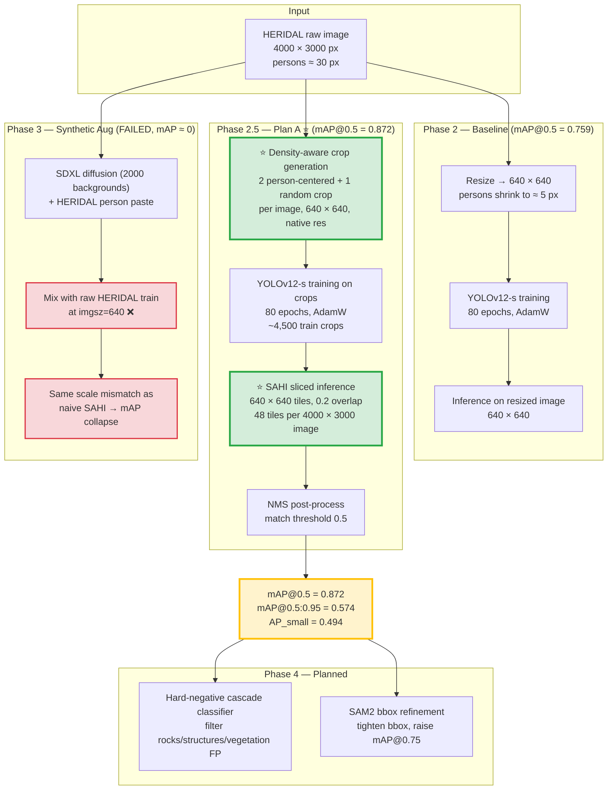
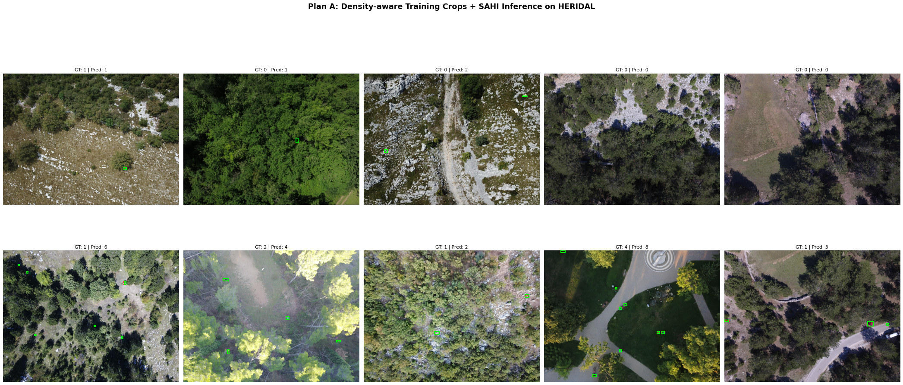

# UAV Search & Rescue Person Detection

A research project on **real-time UAV-based person detection for Search and Rescue (SAR)** in wilderness aerial imagery. The main contribution is a **density-aware training crops + SAHI sliced inference pipeline** ([Plan A](docs/phase3_lessons_learned.md)) that pushes YOLOv12-s on HERIDAL from a baseline of mAP@0.5 = 0.759 to **mAP@0.5 = 0.872** without modifying the detector architecture.

---

## Table of Contents

1. [Project Overview Diagram](#1-project-overview-diagram)
2. [Headline Results](#2-headline-results)
3. [Current Status](#3-current-status)
4. [Phase 1 — VisDrone Baseline](#4-phase-1--visdrone-baseline)
5. [Phase 2 — HERIDAL Baseline](#5-phase-2--heridal-baseline)
6. [Phase 2.5 — Plan A: Density-aware Crops + SAHI ⭐](#6-phase-25--plan-a-density-aware-crops--sahi-)
7. [Phase 3 — Synthetic Data Augmentation (Negative Result)](#7-phase-3--synthetic-data-augmentation-negative-result)
8. [Qualitative Results & Observed Failure Modes](#8-qualitative-results--observed-failure-modes)
9. [Phase 4 — Planned Work](#9-phase-4--planned-work)
10. [Repository Structure](#10-repository-structure)
11. [Tech Stack & Compute](#11-tech-stack--compute)
12. [Citations](#12-citations)

---

## 1. Project Overview Diagram

The novelty in this project is **not in the detector architecture** (YOLOv12-s is used as-is from the official release). Innovations live at the **data preprocessing** and **inference** stages, marked **⭐** below.



**Key insight (green nodes):** the model architecture is unchanged. The contribution is aligning the **training data distribution** (native-resolution crops) with the **inference data distribution** (native-resolution SAHI tiles). Failing to align them caused both naive SAHI and the Phase 3 synthetic-augmentation attempts to collapse (red nodes).

---

## 2. Headline Results

| Stage | mAP@0.5 | mAP@0.5:0.95 | AP_small | Detail |
|---|---|---|---|---|
| Phase 1 — VisDrone baseline (urban) | 0.552 | 0.231 | — | [results/comparison_n_vs_s.md](results/comparison_n_vs_s.md) |
| Phase 2 — HERIDAL baseline (wilderness) | 0.759 | 0.344 | — | [results/yolov12s_heridal_baseline_summary.json](results/yolov12s_heridal_baseline_summary.json) |
| Naive SAHI (without crop training) ❌ | 0.255 | 0.129 | 0.002 | [docs/phase3_lessons_learned.md](docs/phase3_lessons_learned.md) |
| **Phase 2.5 — Plan A ⭐ (crops + SAHI)** | **0.872** | **0.574** | **0.494** | [results/plan_a_analysis.md](results/plan_a_analysis.md) · [JSON](results/plan_a_density_crops_result.json) |
| Phase 3 — SDXL synthetic + raw HERIDAL ❌ | 0.013 | 0.007 | 0.043 | [docs/phase3_lessons_learned.md](docs/phase3_lessons_learned.md) |
| Phase 3 — HERIDAL composite + raw HERIDAL ❌ | 0.000 | 0.000 | 0.000 | [docs/phase3_lessons_learned.md](docs/phase3_lessons_learned.md) |

Δ Plan A vs Phase 2 baseline: **+0.113 mAP@0.5 (+15.0% relative)**, **+0.229 mAP@0.5:0.95 (+66.5% relative)**, AP_small from ~0 → 0.494 (≈250× over naive SAHI).

---

## 3. Current Status

| Phase | Weeks | Status |
|---|---|---|
| 1. Setup & VisDrone baseline | 1–3 | ✅ Done |
| 2. HERIDAL baseline | 4 | ✅ Done |
| 2.5. Density-aware crops + SAHI (Plan A) | 5 | ✅ Done — **main contribution** |
| 3. Diffusion-based synthetic data | 6–9 | ⚠️ Attempted, abandoned — see [docs/phase3_lessons_learned.md](docs/phase3_lessons_learned.md) |
| 4. GAN-based synth + post-processing (cascade + SAM2) | 10–11 | ⚪ Planned |
| 5. Cross-domain eval (HERIDAL → SARD) | 12 | ⚪ Upcoming |
| 6. Demo & paper writing | 13–16 | ⚪ Upcoming |

---

## 4. Phase 1 — VisDrone Baseline

### Method

- **Dataset:** VisDrone-DET filtered to the `person`+`people` classes (5,684 train, 548 val) — script: [src/filter_visdrone.py](src/filter_visdrone.py).
- **Detector:** YOLOv12 nano and small variants ([sunsmarterjie/yolov12](https://github.com/sunsmarterjie/yolov12), Ultralytics-compatible), COCO-pretrained init.
- **Training:** 80 epochs, AdamW, `imgsz=640`, batch 16, AMP, single Tesla T4 (Kaggle free tier). Config: [configs/visdrone_person.yaml](configs/visdrone_person.yaml). Trainer: [src/train_yolov12.py](src/train_yolov12.py).

### Paper applied

- **YOLOv12 — Attention-Centric Real-Time Object Detectors** (Tian et al., NeurIPS 2025, [arXiv:2502.12524](https://arxiv.org/abs/2502.12524)) — used as the base detector. We use the released weights and Ultralytics-compatible interface directly; no architectural modification.

### Result

| Metric | YOLOv12-n | YOLOv12-s |
|---|---|---|
| mAP@0.5 | 0.476 | **0.552** |
| mAP@0.5:0.95 | 0.187 | **0.231** |
| Recall | 0.438 | **0.497** |

YOLOv12-s selected (Δ mAP@0.5 = +0.076 over -n at modest compute cost). Detailed comparison: [results/comparison_n_vs_s.md](results/comparison_n_vs_s.md) · raw metrics: [yolov12n](results/yolov12n_baseline_summary.json) · [yolov12s](results/yolov12s_baseline_summary.json).

---

## 5. Phase 2 — HERIDAL Baseline

### Method

- **Dataset switch:** moved from urban (VisDrone) to wilderness (HERIDAL, 1,124 train / 313 val / 163 test, 4000×3000 aerial RGB). Rationale: [docs/dataset_selection.md](docs/dataset_selection.md).
- **Detector:** same YOLOv12-s configuration as Phase 1, retrained from scratch on HERIDAL (`imgsz=640`, 100 epochs, AdamW).
- **Inference:** standard YOLOv12 forward on the full resized image (4000×3000 → 640×640).

### Paper applied

- **HERIDAL — Deep Learning Approach in Aerial Imagery for Supporting Land Search and Rescue Missions** (Božić-Štulić et al., IJCV 2019, [DOI](https://doi.org/10.1007/s11263-019-01177-1)) — the dataset paper; we use the standard train/val split released with it.

### Result

| Metric | VisDrone (urban) | **HERIDAL (wilderness)** | Δ |
|---|---|---|---|
| mAP@0.5 | 0.552 | **0.759** | +0.207 |
| mAP@0.5:0.95 | 0.231 | **0.344** | +0.113 |
| Precision | 0.690 | 0.749 | +0.059 |
| **Recall** | 0.497 | **0.713** | **+0.216** |

HERIDAL outperforms VisDrone despite 5× fewer training images, because aerial wilderness imagery contains much less semantic clutter than urban scenes. Detail: [results/comparison_visdrone_vs_heridal.md](results/comparison_visdrone_vs_heridal.md) · raw: [results/yolov12s_heridal_baseline_summary.json](results/yolov12s_heridal_baseline_summary.json).

### Limitation observed

mAP@0.5 is reasonable (0.759) but mAP@0.5:0.95 is low (0.344) — the model **finds persons** but **does not localize them tightly**. Diagnosis: at `imgsz=640` on a 4000×3000 image, a typical 30-pixel person shrinks to ~5 pixels. The detector never sees the actual scale at which persons appear at native resolution. This motivates Plan A.

---

## 6. Phase 2.5 — Plan A: Density-aware Crops + SAHI ⭐

This is the **main contribution** of the project. Full write-up: [results/plan_a_analysis.md](results/plan_a_analysis.md). Raw metrics: [results/plan_a_density_crops_result.json](results/plan_a_density_crops_result.json).

### Motivation

Advisor feedback (2026-05-13): *"Tăng accuracy bằng clustering và cropping image dựa trên density"* — improve accuracy by clustering and cropping images based on density.

A naive interpretation is to apply SAHI sliced inference to the Phase 2 model. We tried this and it **failed catastrophically** (mAP@0.5 dropped from 0.759 → 0.255, AP_small ≈ 0.002 — the model hallucinated hundreds of detections on each tile). The reason: the model was only ever trained on heavily downsampled images, so when SAHI fed it native-resolution patches at inference time, the input was out-of-distribution.

### Method

The fix is to **move the density-aware step into training**, so the train and inference distributions match.

**Step 1 — Native-resolution crop generation** (data preprocessing)

For each 4000×3000 training image:
- **2 person-centered crops per ground-truth person**, each 640×640, with random offset of up to ±160 px (jitter so the person is not always exactly centered).
- **1 random crop** per image (regardless of person content) to give the model exposure to "negative" backgrounds and learn to suppress false positives.
- A ground-truth bounding box is kept only if more than 50% of its area falls inside the crop.

Output: ~4,500 train crops + ~600 val crops, all at native pixel scale (no resize).

**Step 2 — Training**

YOLOv12-s initialized from COCO-pretrained weights, fine-tuned on the crops dataset for 80 epochs (AdamW, lr=0.001, batch=16, AMP, single Tesla T4). Weights backed up locally + Google Drive + Kaggle dataset `hung1244/yolov12s-heridal-crops-best`.

**Step 3 — SAHI sliced inference**

Inference is run on the **original 4000×3000 validation images** (not the crops):
- Slice 640×640 with 0.2 overlap → ~48 tiles per image
- `perform_standard_pred=False` (sliced predictions only)
- `postprocess_type="NMS"`, match threshold 0.5

Evaluation: pycocotools COCO eval on original-resolution coordinates.

### Papers applied

- **SAHI — Slicing Aided Hyper Inference and Fine-tuning for Small Object Detection** (Akyon, Altinuc, Temizel, ICIP 2022, [arXiv:2202.06934](https://arxiv.org/abs/2202.06934)) — provides the sliced inference pipeline. **How we apply it differently from the original SAHI paper:** SAHI was originally proposed as an inference-only technique on top of off-the-shelf models. We found that this is insufficient when the training resolution is mismatched with the inference resolution. Our contribution is to **pair SAHI with density-aware training-time crops**, treating sliced inference as half of a coupled train+inference pipeline rather than a standalone post-hoc trick.
- **YOLOv12** (Tian et al., NeurIPS 2025) — base detector, unchanged.

### Result

| Metric | Phase 2 baseline | Naive SAHI ❌ | **Plan A (crops + SAHI)** | Δ vs baseline |
|---|---|---|---|---|
| mAP@0.5 | 0.759 | 0.255 | **0.872** | **+0.113** (+15.0% rel) |
| mAP@0.5:0.95 | 0.344 | 0.129 | **0.574** | **+0.229** (+66.5% rel) |
| mAP@0.75 | — | 0.117 | **0.661** | (large) |
| AP_small | — | 0.002 | **0.494** | (~250× over naive SAHI) |
| AR_100 | — | 0.438 | **0.662** | +0.224 |

### Key insight

> Density-aware *inference* (SAHI) only works when the model has also seen density-aware *training* samples. Inference-time slicing alone reintroduces the train–test distribution gap it was supposed to solve.

This is the central finding of the project. The Phase 3 negative result below confirms it from the opposite direction (same mismatch reintroduced via raw-HERIDAL mixing breaks the model again).

---

## 7. Phase 3 — Synthetic Data Augmentation (Negative Result)

Full write-up of failure and diagnosis: [docs/phase3_lessons_learned.md](docs/phase3_lessons_learned.md). Pivot from AirSim to diffusion (msgpack-rpc-python incompatibility): [docs/phase3_pivot_to_diffusion.md](docs/phase3_pivot_to_diffusion.md).

### Approach A — SDXL synthetic backgrounds + HERIDAL person paste

**Method**
1. Generate 2,000 aerial backgrounds with **Stable Diffusion XL** (1024×1024).
2. Composite HERIDAL person crops onto these backgrounds (alpha-blended edges, random scale 25–80 px, random rotation).
3. Train YOLOv12-s on **raw HERIDAL train (4000×3000)** mixed with the 2,000 synthetic 1024×1024 images.
4. Evaluate with SAHI sliced inference (same as Plan A).

Sample SDXL backgrounds: [figures/synthetic_bg/](figures/synthetic_bg/) (8 representative images).

**Paper applied**
- **SDXL — Stable Diffusion XL** (Podell et al., 2023, [arXiv:2307.01952](https://arxiv.org/abs/2307.01952)) — used out-of-the-box for background generation, conditioned on aerial-wilderness text prompts.

**Result**

| Metric | Value |
|---|---|
| mAP@0.5 | 0.013 |
| mAP@0.5:0.95 | 0.007 |
| AP_small | 0.043 |
| AR_100 | 0.039 |

→ Essentially zero. Raw metrics: would-be experiment outputs `all_result.json` (local).

### Approach B — HERIDAL-to-HERIDAL copy-paste + raw HERIDAL

**Method**
1. Extract person crops from HERIDAL train.
2. Composite them onto **other HERIDAL train images** (real-photography on both sides — no domain gap).
3. Train YOLOv12-s on raw HERIDAL train + 2,000 same-domain composite samples.
4. Evaluate with SAHI sliced inference.

**Paper applied**
- **Copy-Paste augmentation — Simple Copy-Paste is a Strong Data Augmentation Method for Instance Segmentation** (Ghiasi et al., CVPR 2021, [arXiv:2012.07177](https://arxiv.org/abs/2012.07177)) — same-domain copy-paste recipe, adapted for detection.

**Result**

| Metric | Value |
|---|---|
| mAP@0.5 | 0.000 |
| mAP@0.5:0.95 | 0.000 |
| AP_small | 0.0001 |
| AR_100 | 0.0018 |

→ Even with no domain gap, the model still collapsed.

### Root-cause diagnosis

Both approaches reintroduced the same train–inference scale mismatch that Plan A solved. Mixing 4000×3000 raw HERIDAL images into training (at `imgsz=640`) dominates the gradient with ~5-pixel persons, while SAHI inference presents ~30-pixel persons in 640×640 tiles. Domain mismatch (synthetic looking unlike HERIDAL) is a real but secondary concern; the dominant failure was scale, not domain.

### Takeaway

> Naïve mixing of synthetic data with raw full-resolution training images defeats SAHI sliced inference. To benefit from synthetic augmentation under SAHI, the synthetic samples must be processed through the same density-aware crop pipeline as the real data (**"crop-then-synthesize"**, identified as concrete future work).

Plan A weights are preserved and remain the project's working baseline; Phase 3 is documented as an honest negative result, not a regression.

---

## 8. Qualitative Results & Observed Failure Modes



*Red dashed = ground truth, lime solid = Plan A predictions. Plan A finds the annotated persons reliably; remaining false positives are concentrated on natural distractors.*

Per-image visualizations (10 samples + grid montage): [results/visualizations/](results/visualizations/).

### Observed failure modes

Qualitative inspection of Plan A predictions reveals false positives on natural objects with person-like silhouettes at aerial distance:

- **Rocks** — vertical formations of person-sized scale
- **Small structures / huts / ruins** — similar aspect ratio to persons
- **Dense vegetation** — occasionally mistaken for lying or crouched persons

These are the targets for Phase 4 post-processing (cascade classifier + SAM2 refinement).

---

## 9. Phase 4 — Planned Work

Phase 4 is the next research direction, currently in proposal stage. Two complementary techniques targeting Plan A's two remaining issues:

### Direction A — Hard-Negative Cascade Classifier (targets false positives)

Train a lightweight ResNet18 / MobileNetV3 classifier on cropped predictions to distinguish `person` from `rock / structure / vegetation`, applied as a second stage after SAHI to filter Plan A's false positives.

- **Paper applied:** **Cascade R-CNN — Delving into High Quality Object Detection** (Cai & Vasconcelos, CVPR 2018, [arXiv:1712.00726](https://arxiv.org/abs/1712.00726)) — cascade design pattern; we apply it as a post-hoc classifier cascade rather than IoU-cascade.

### Direction B — SAM2 Bbox Refinement (targets mAP@0.75 and mAP@0.5:0.95)

Use **SAM2** segmentation prompted by each Plan A bbox to refine the bbox tight around the segmented person mask, raising localization quality without affecting recall.

- **Paper applied:** **SAM 2 — Segment Anything in Images and Videos** (Ravi et al., Meta AI 2024, [arXiv:2408.00714](https://arxiv.org/abs/2408.00714)) — used zero-shot with bbox prompts; no training required.

### Direction C (future, conditional on Phase 4A/B success) — GAN-based synthetic with crop-then-synthesize

Replace the Phase 3 SDXL pipeline with a **StyleGAN2-ADA** generator trained on HERIDAL background crops, then composite real persons + apply the density-aware crop pipeline (same as Plan A) **before** training. Closes the loop on Phase 3.

- **Paper applied:** **Training Generative Adversarial Networks with Limited Data (StyleGAN2-ADA)** (Karras et al., NeurIPS 2020, [arXiv:2006.06676](https://arxiv.org/abs/2006.06676)) — designed for limited-data regimes such as HERIDAL's 1,124 training images.

---

## 10. Repository Structure

```
UAV_res/
├── README.md                              # This file
├── docs/
│   ├── proposal.md                        # 16-week project proposal
│   ├── progress_report.md                 # Weekly progress log
│   ├── dataset_selection.md               # Why HERIDAL was chosen
│   ├── phase3_pivot_to_diffusion.md       # AirSim → SDXL pivot rationale
│   └── phase3_lessons_learned.md          # Phase 3 negative-result post-mortem
├── figures/
│   └── synthetic_bg/                      # Sample SDXL backgrounds (Phase 3)
├── results/
│   ├── plan_a_analysis.md                 # Plan A detailed write-up
│   ├── plan_a_density_crops_result.json   # Plan A raw metrics
│   ├── yolov12n_baseline_summary.json     # VisDrone n-variant metrics
│   ├── yolov12s_baseline_summary.json     # VisDrone s-variant metrics
│   ├── yolov12s_heridal_baseline_summary.json   # Phase 2 metrics
│   ├── comparison_n_vs_s.md               # Phase 1 n vs s comparison
│   ├── comparison_visdrone_vs_heridal.md  # Phase 1 vs Phase 2 comparison
│   └── visualizations/                    # Plan A qualitative predictions
├── src/
│   ├── filter_visdrone.py                 # VisDrone person-class filter
│   └── train_yolov12.py                   # Training loop wrapper
├── configs/
│   └── visdrone_person.yaml               # Dataset config
└── notebooks/
    └── README.md                          # Links to Kaggle notebooks
```

---

## 11. Tech Stack & Compute

**Stack**
- PyTorch 2.10 + CUDA 12.8 (nightly required on RTX 5090 Blackwell sm_120)
- Ultralytics 8.4.x
- YOLOv12 (Ultralytics-compatible weights, [sunsmarterjie/yolov12](https://github.com/sunsmarterjie/yolov12))
- SAHI 0.11.x
- pycocotools (evaluation)
- Stable Diffusion XL (Phase 3, abandoned)

**Compute**
- **Primary:** Kaggle free tier (2× Tesla T4, 30 h/week quota) — Phases 1, 2, 2.5
- **One-shot:** rented RTX 5090 VM (24 h, ~$18) — Phase 3 only
- **Total compute used:** ~50 GPU-hours; Plan A itself ~3 h on a single T4

---

## 12. Citations

### Base detector
- Tian, Y., Ye, Q., & Doermann, D. (2025). **YOLOv12: Attention-Centric Real-Time Object Detectors.** *NeurIPS 2025.* [arXiv:2502.12524](https://arxiv.org/abs/2502.12524) · [Code](https://github.com/sunsmarterjie/yolov12)

### Datasets
- Božić-Štulić, D., Marušić, Ž., & Gotovac, S. (2019). **Deep Learning Approach in Aerial Imagery for Supporting Land Search and Rescue Missions.** *IJCV.* [DOI](https://doi.org/10.1007/s11263-019-01177-1) — *HERIDAL dataset paper.*
- Zhu, P., Wen, L., Du, D., Bian, X., Fan, H., Hu, Q., & Ling, H. (2021). **Detection and Tracking Meet Drones Challenge.** *TPAMI.* [arXiv:2001.06303](https://arxiv.org/abs/2001.06303) · [VisDrone Dataset](https://github.com/VisDrone/VisDrone-Dataset)

### Methods applied in Plan A (Phase 2.5)
- Akyon, F. C., Altinuc, S. O., & Temizel, A. (2022). **Slicing Aided Hyper Inference and Fine-tuning for Small Object Detection (SAHI).** *ICIP.* [arXiv:2202.06934](https://arxiv.org/abs/2202.06934)

### Methods explored in Phase 3 (negative result)
- Podell, D., English, Z., Lacey, K., Blattmann, A., Dockhorn, T., Müller, J., Penna, J., & Rombach, R. (2023). **SDXL: Improving Latent Diffusion Models for High-Resolution Image Synthesis.** [arXiv:2307.01952](https://arxiv.org/abs/2307.01952)
- Ghiasi, G., Cui, Y., Srinivas, A., Qian, R., Lin, T.-Y., Cubuk, E. D., Le, Q. V., & Zoph, B. (2021). **Simple Copy-Paste is a Strong Data Augmentation Method for Instance Segmentation.** *CVPR.* [arXiv:2012.07177](https://arxiv.org/abs/2012.07177)

### Methods planned for Phase 4
- Cai, Z., & Vasconcelos, N. (2018). **Cascade R-CNN: Delving into High Quality Object Detection.** *CVPR.* [arXiv:1712.00726](https://arxiv.org/abs/1712.00726)
- Ravi, N., Gabeur, V., Hu, Y.-T., Hu, R., Ryali, C., Ma, T., Khedr, H., Rädle, R., et al. (2024). **SAM 2: Segment Anything in Images and Videos.** *Meta AI.* [arXiv:2408.00714](https://arxiv.org/abs/2408.00714)
- Karras, T., Aittala, M., Hellsten, J., Laine, S., Lehtinen, J., & Aila, T. (2020). **Training Generative Adversarial Networks with Limited Data (StyleGAN2-ADA).** *NeurIPS.* [arXiv:2006.06676](https://arxiv.org/abs/2006.06676)

### Related work referenced in proposal
- Tobin, J., Fong, R., Ray, A., Schneider, J., Zaremba, W., & Abbeel, P. (2017). **Domain Randomization for Transferring Deep Neural Networks from Simulation to the Real World.** *IROS.* [arXiv:1703.06907](https://arxiv.org/abs/1703.06907)
- Shah, S., Dey, D., Lovett, C., & Kapoor, A. (2017). **AirSim: High-Fidelity Visual and Physical Simulation for Autonomous Vehicles.** *FSR.* [arXiv:1705.05065](https://arxiv.org/abs/1705.05065) — *Original simulator plan, abandoned in Phase 3 due to msgpack-rpc-python incompatibility.*

---

## License

Research / academic use. See individual paper and dataset licenses for upstream materials.
